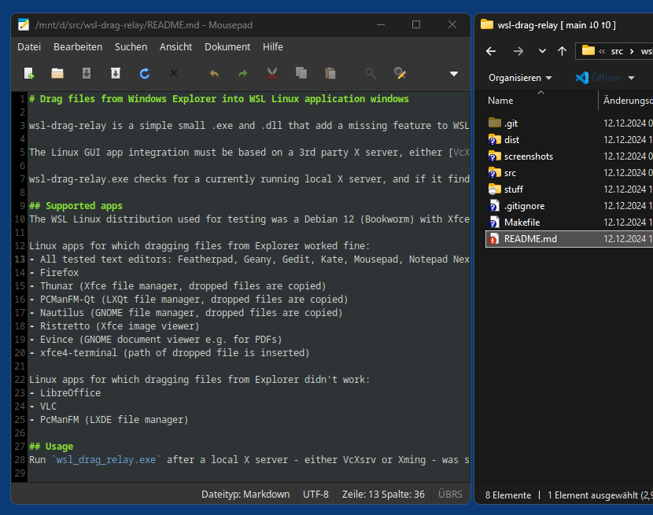

# Drag files from Windows Explorer into WSL Linux GUI application windows

wsl-drag-relay is a simple small utility that adds a missing feature to WSL in Windows 10/11: to allow dragging a file (or multiple files) from a Windows Explorer window (including the Windows desktop) into the X window of a local Linux GUI app, like e.g. a text editor or an image viewer, to open it in this app. As a bonus, it also automatically makes Linux app window title bars dark if the Windows system is configured to use dark mode (for apps).

The Linux GUI app integration must be based on a 3rd party X server, either [VcXsrv](https://sourceforge.net/projects/vcxsrv/) or [Xming](http://www.straightrunning.com/XmingNotes/). So while both WSL 1 and 2 are supported, WSLg currently is not. You have to deactivate WSLg (WSL Settings -> Optional Features) and install/use either VcXsrv or Xming.

wsl-drag-relay.exe checks for a currently running local X server, and if it finds one, it injects wsl-drag-relay.dll into the server's process. This .dll then watches for new top level X windows (via RegisterWindowMessage). Whenever a new window is found, Windows drag support is activated for this window (via DragAcceptFiles) and all Windows drop events based on local files are forwarded as X11 drop events to the Linux app, where "local" means that the dropped files must have paths starting with a drive letter, UNC paths/SMB shares etc. are not supported.

## Usage
Run `wsl_drag_relay.exe` after a local X server - either VcXsrv or Xming - was started, done. Or even simpler, put a .xlaunch file - like the provided file [auto.xlaunch](dist/auto.xlaunch) - into the same folder as wsl_drag_relay.exe (and the 7 .dlls), set "ClientMode" to "StartProgram" and add wsl_drag_relay.exe as "LocalProgram". Double-clicking the .xlaunch file will then automatically both start your X server (in "Multiple Windows" mode) and wsl_drag_relay.exe, which will inject `wsl_drag_relay.dll` into the server's process and run in the background until the X server is shutdown.

## Screenshot

*README.md dragged from Windows 11 Explorer into Debian 12 Mousepad*  


## Tested Linux apps
The WSL Linux distribution used for testing was Debian 12 (Bookworm) with Xfce4 desktop, both in WSL 1 and WSL 2, using either VcXsrv or Xming as X server.

Linux apps for which dragging files from Explorer worked fine:
- All tested text editors: Featherpad, Geany, Gedit, Kate, Mousepad, Notepad Next, SciTE, Sublime Text, Xed
- Firefox
- Thunar (Xfce file manager, dropped files are copied)
- PCManFM-Qt (LXQt file manager, dropped files are copied)
- Nautilus (GNOME file manager, dropped files are copied)
- Ristretto (Xfce image viewer)
- Evince (GNOME document viewer e.g. for PDFs)
- xfce4-terminal (path of dropped file is inserted)

Linux apps for which dragging files from Explorer didn't work:
- LibreOffice
- VLC
- PcManFM (LXDE file manager)

## Compiling
Requirements:
- CygWin x86_64 with the following packages:
    - mingw64-x86_64-gcc-core
    - mingw64-x86_64-gcc-g++
    - gcc-g++
    - make
    - libX11-devel
    - git

In a CygWin shell run:
```
$ git clone https://github.com/59de44955ebd/wsl-drag-relay.git
$ cd wsl-drag-relay
$ make
```